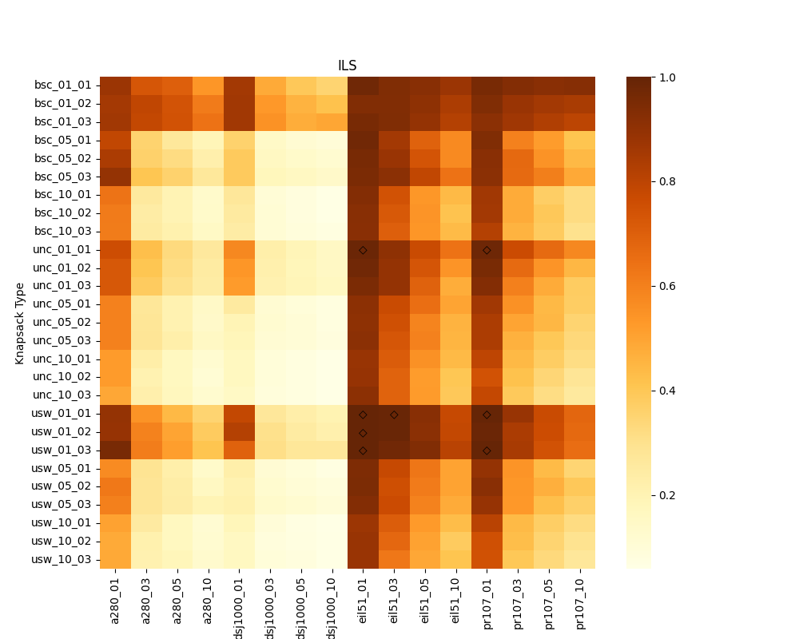
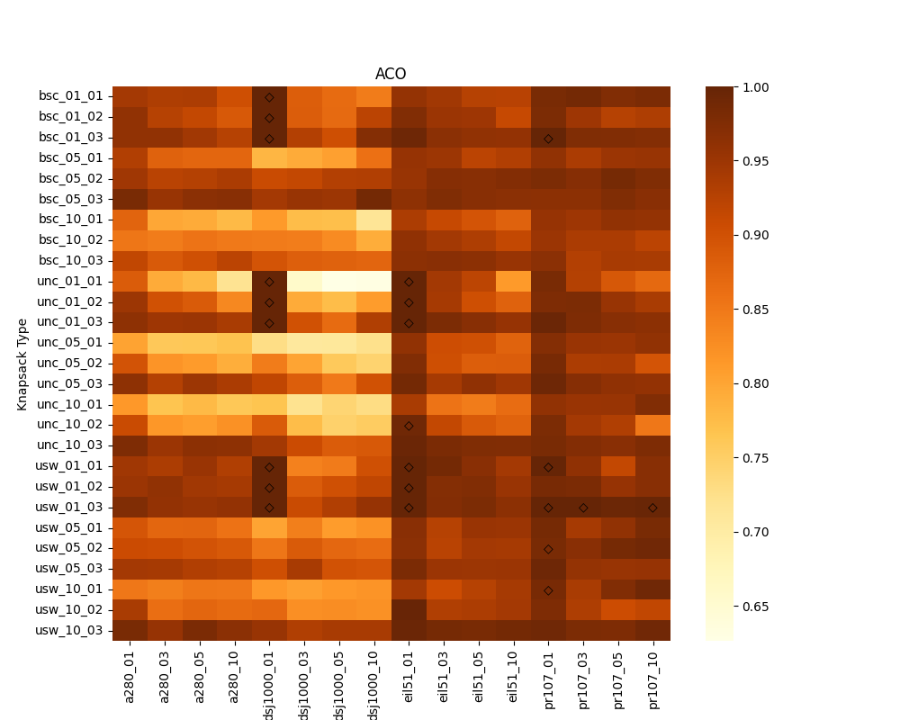
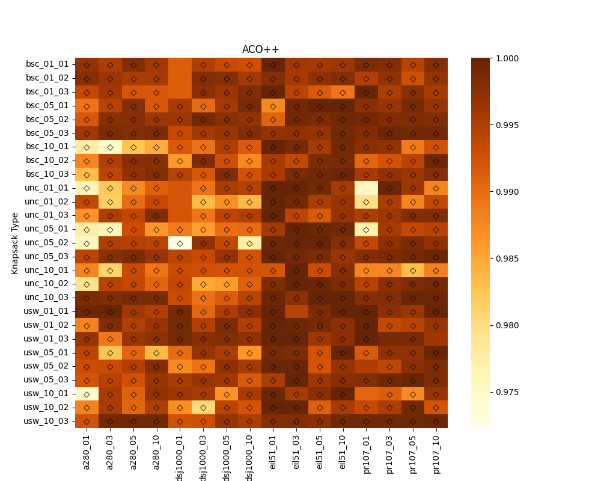

# ThOP - Experiments & Visualization
<div align="center">
    
</div>
<p align="center"> 
    <a aria-label="Thopvis is free to use" href="/LICENSE" target="_blank">
        
    </a>
</p>

---
A tool that allows users to visualize and run different thop instances to observe the thief's route and packing plan.

## Disclaimer
This is **strictly** for educational purposes only and serves as a final project for my CS106 - Artificial Intelligence course at UIT.

The algorithms and experimental methods used in this repository are derived from [acoplusplus](https://github.com/jonatasbcchagas/acoplusplus_thop) and the paper [Efficiently solving the thief orienteering problem with a max-min ant colony optimization algorithm](https://link.springer.com/article/10.1007/s11590-021-01824-y).

I am in no way associated with Jonatas B. C. Chagas and Markus Wagner.

## Usage
You can find the visualization tool `thopvis` in the `thop_visualiser` directory.

You may also need to install some Python dependencies to run the visualizer:

```shell
pip install tk tkscrolledframe matplotlib
```
To start the visualizer, simply run the following commands:

```shell
cd thop_visualiser
python thopvis.py
```

**Note**: This tool was previously designed to run solely on Linux, but it can still load and run the existing `eil51-thop` instances on Windows.

## Comparison of ThOP solution approaches
Because all algorithms are randomized, we have performed 5 independent runs
per instance. Each run has been executed with the parameter values with the best mean
performance. Raw results and solutions found, are also available at `acoplusplus_thop/solutions`.

We plot for every instance and algorithm the approximation ratio as a heatmap
in order to highlight larger differences.
<p align="middle">
  
</p>

 Moreover, we use diamond symbols to highlight
the instances for which each algorithm has found the best known solutions.
| i↓  j→ | ILS   | ACO   | ACO++ |
|-------|-------|-------|-------|
| ILS   | -     | 2.55% | 1.16% |
| ACO   | 98.38%| -     | 4.86% |
| ACO++ | 99.77%| 96.99%| -     |

Percentage of the number of instances in which algorithm *i* found better or equal quality solutions than algorithm *j*

**Note**: The notebook source code for creating these heatmaps and table can be found in `acoplusplus/results_analysis.ipynb`.

## Additional Resources
You can access additional resources, including presentation slides and a demo video with voiceover (in Vietnamese), in the [CS106_Group9 Drive](https://drive.google.com/drive/folders/1_g84q3nKzPJuTxqAiIHXzZoJVrh4dLOk?usp=drive_link).

---
<p align="center">Dev-Aligator</p>
<p align="center">
<a href="https://github.com/Dev-Aligator/">

</a>